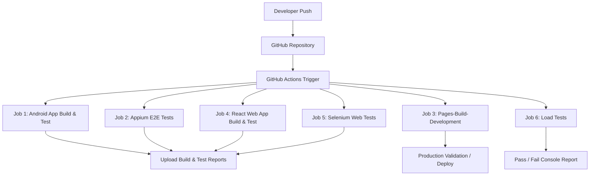

# React Deployment and Selenium E2E Testing Documentation

This document provides a comprehensive, step-by-step guide to deploying the FinGuard React application, configuring routing for seamless hosting on GitHub Pages, setting up automated end-to-end (E2E) testing with Selenium, and automating the entire pipeline using GitHub Actions CI/CD workflows.

---

### Step 1 — Push Your React Project to GitHub
Inside your React project folder:

```bash
git init
git add .
git commit -m "Initial frontend upload"
git branch -M main
git remote add origin https://github.com/YOUR_USERNAME/YOUR_REPO.git
git push -u origin main
```

Replace:
- `YOUR_USERNAME`
- `YOUR_REPO`

with your GitHub details.

---

### Step 2 — Install GitHub Pages Package
Inside the frontend project:

```bash
npm install gh-pages --save-dev
```

---

### Step 3 — Update package.json
Open `package.json`.

Add the `homepage` field:

```json
"homepage": "https://YOUR_USERNAME.github.io/YOUR_REPO",
```

Inside the `scripts` section, add:

```json
"predeploy": "npm run build",
"deploy": "gh-pages -d build"
```

Example `package.json` excerpt:

```json
"scripts": {
  "start": "react-scripts start",
  "build": "react-scripts build",
  "predeploy": "npm run build",
  "deploy": "gh-pages -d build"
}
```

---

### Step 4 — Deploy React Project to GitHub Pages
Inside the frontend project folder run:

```bash
npm run deploy
```

This command:
- Builds the React application.
- Creates a production build in the `build` folder.
- Uploads the build to the `gh-pages` branch on GitHub.

---

### Step 5 — Enable GitHub Pages
1. Open your GitHub repository.
2. Go to: **Settings** → **Pages**.
3. Under **Build and deployment**:
4. Select: **Source** → **Deploy from branch**.
5. Choose: **Branch** → **gh-pages** (root directory).
6. Click **Save**.

---

### Step 6 — Access the Live Application
After deployment, GitHub provides a live URL:

```
https://YOUR_USERNAME.github.io/YOUR_REPO
```

---

### Step 7 — Configure React Router for GitHub Pages
Replace:

```javascript
import { BrowserRouter } from 'react-router-dom';
```

With:

```javascript
import { HashRouter } from 'react-router-dom';
```

Then update:

```jsx
<BrowserRouter>
```

To:

```jsx
<HashRouter>
```

This prevents **404 Page Not Found** errors on page refresh or direct route access.

---

### Step 8 — Rebuild and Redeploy
After updating the router configuration, redeploy the frontend by running:

```bash
npm run deploy
```

This ensures the deployment is updated with the new hash-based routing.

---

### Step 9 — Verify Navigation and Direct Access
After rebuilding and redeploying, verify that direct URL access to sub-routes works seamlessly without throwing any 404 errors.

Example:
```
https://YOUR_USERNAME.github.io/YOUR_REPO/#/login
```

---

### Step 10 — Add Selenium E2E Testing
Install Selenium dependencies:

```bash
npm install selenium-webdriver mocha --save-dev
```

---

### Step 11 — Create Selenium Test Structure
Recommended structure for E2E tests:

```text
frontend/
│
├── selenium_tests/
│   ├── tests/
│   │   └── login.test.js
│   ├── reports/
│   ├── excel_reporter.js
│   ├── test_runner.js
│   ├── package.json
│   └── package-lock.json
```

---

### Step 12 — Add Stable IDs for Automation
Use stable, explicit element identifiers in your components:

```html
<input id="email" />
<input id="password" />
<button id="login-button" />
```

This allows Selenium to locate elements reliably and reduces test flakiness.

---

### Step 13 — Run Selenium Test Locally
Run:

```bash
npm run test
```

This:
- Opens the browser (or runs in headless mode).
- Navigates to the local welcome/login page.
- Enters credentials automatically.
- Validates successful redirection to the dashboard.
- Generates Excel test reports under `reports/`.

---

### Step 14 — Setup GitHub Actions
Create a CI/CD workflow file in your project under:

```text
.github/workflows/ci.yml
```

GitHub Actions will automatically:
- Install all necessary project dependencies.
- Build the web application.
- Run Selenium tests on standard push/PR events.
- Generate and report the pass/fail status.

---

### Step 15 — Automatic CI/CD Testing
Whenever code is pushed:

```bash
git push
```

GitHub Actions automatically triggers:
- Build validation.
- E2E testing suites (Appium, Selenium).
- Baseline API load testing.
- Automatic deployment verification.

---

## Final Architecture



This creates a modern frontend deployment and automation testing pipeline that ensures high reliability and fast delivery.
